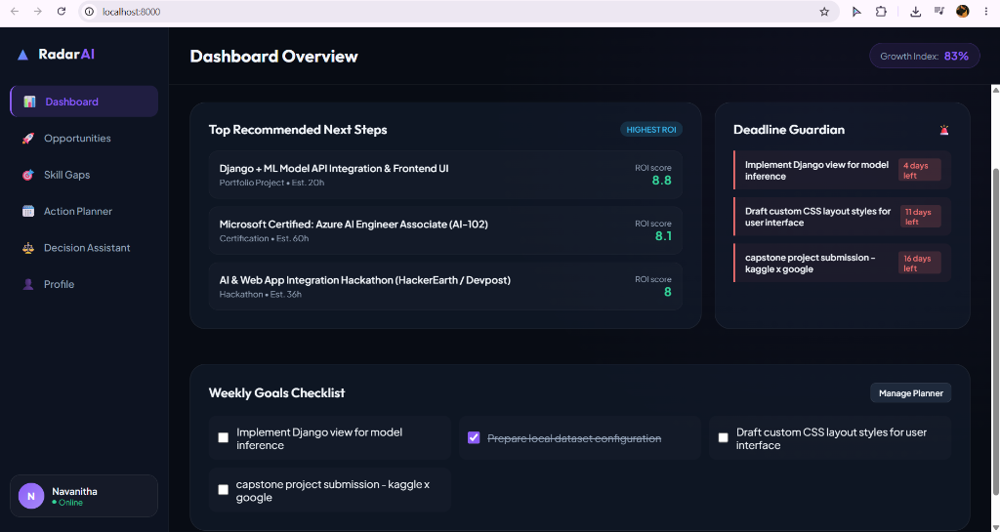
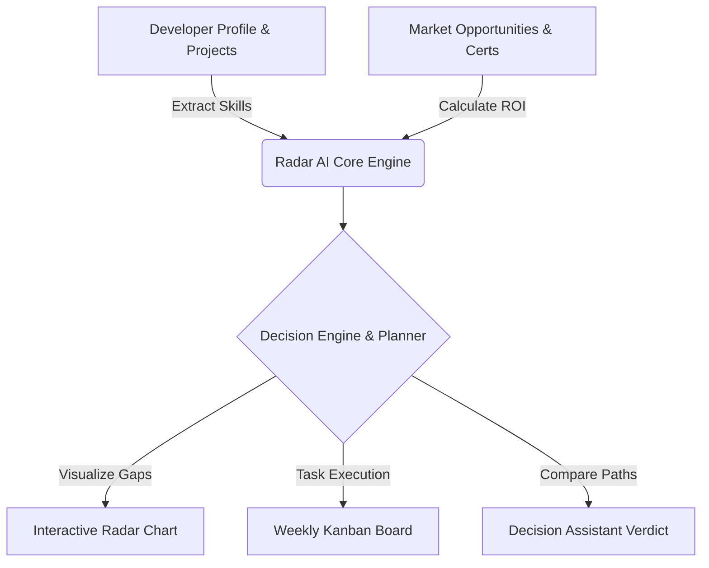

# Radar AI Career Navigator 🚀



An autonomous, data-driven career strategist and opportunity tracker designed to maximize long-term career growth, learning potential, income, and professional visibility. 

Radar AI Career Navigator bridges the gap between your active development projects and target industry roles by analyzing skill gaps, calculating dynamic ROI scores for career actions, and organizing daily tasks in an interactive, responsive glassmorphic dashboard.

---

## 🌟 Key Features

1. **Strategic Dashboard**: Real-time visualization of your growth index, target roles, active opportunities, and upcoming high-priority deadlines.
2. **ROI Scoring Engine**: Dynamic algorithm scoring opportunities based on:
   $$\text{ROI} = \frac{\text{Skill Dev} \times 0.25 + \text{Career Impact} \times 0.25 + \text{Networking} \times 0.15 + \text{Financial} \times 0.15}{1 + (\text{Difficulty} \times 0.04 + \frac{\text{Time Commitment}}{100} \times 0.04)}$$
3. **Role Alignment Radar Chart**: Interactive SVG radar chart matching your current capabilities against target industry profiles (e.g., Full-Stack AI Engineer vs. MLOps Specialist).
4. **Deadline Guardian**: Automated tracker warning about expiring applications and high-priority milestones.
5. **Action Planner**: Drag-and-drop Kanban task board designed to manage daily sprint tasks.
6. **Decision Trade-off Assistant**: Comparative analytics side-by-side engine to help you decide between two opportunities with calculated recommendations.

---

## 🔄 System Workflow & Architecture



1. **Profile Input**: Parses active skills (e.g., Python, Django, scikit-learn).
2. **Opportunities Intake**: Analyzes certifications, hackathons, and projects.
3. **ROI Optimization**: Scores and ranks items from highest impact to lowest.
4. **Action execution**: Spawns weekly tasks to complete target milestones.

---

## 📦 Project Structure

```bash
radar-ai-career-navigator/
├── index.html          # Core layout, modals, and panel container
├── style.css           # Glassmorphic dark theme and visual layout
├── app.js              # Application state, SVG radar charting, and decision logic
├── profile.json        # Dynamic profile data registry
└── opportunities.json  # Scored and ranked opportunities dataset
```

---

## 🚀 Getting Started

### Prerequisites
- Python 3.x (to run the local server) or any static host.

### Local Execution
1. Clone the repository:
   ```bash
   git clone https://github.com/your-username/radar-ai-career-navigator.git
   cd radar-ai-career-navigator
   ```

2. Start the local server:
   ```bash
   python -m http.server 8000
   ```

3. Open your browser and navigate to:
   ```
   http://localhost:8000
   ```

---

## 🛠️ Built With
- **Frontend structure**: HTML5 (Semantic elements)
- **Styling**: Custom CSS3 (Flexbox, CSS Grid, Glassmorphic effects, backdrop filters)
- **Engine Logic**: Vanilla JavaScript (ES6+, dynamic SVG math rendering, LocalStorage sync)
