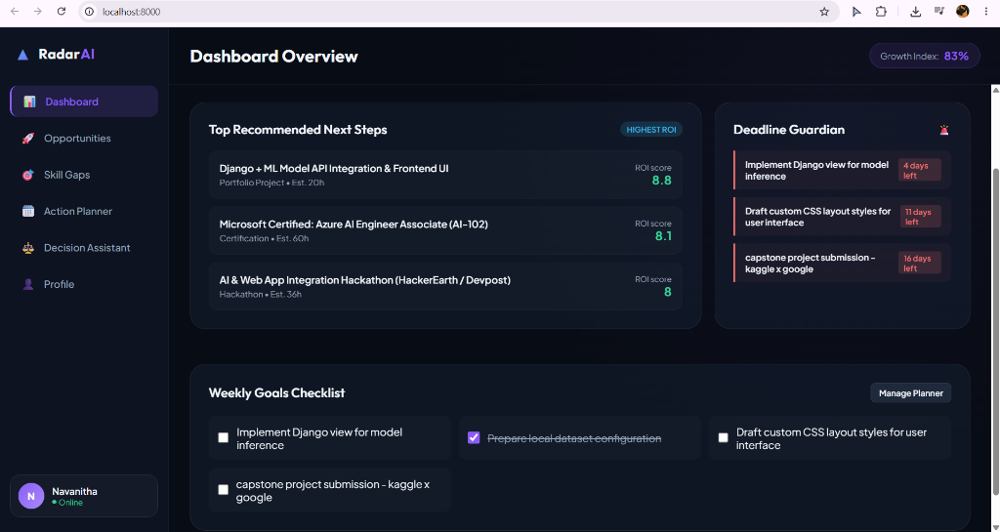

# Radar AI - AI-Powered Career Growth Navigator



**An AI-powered career intelligence platform that helps students and early-career professionals discover opportunities, identify skill gaps and build a personalized career growth path.**

[](https://www.kaggle.com/competitions/vibecoding-agents-capstone-project/writeups/radar-ai-ai-powered-career-growth-navigator)
[](https://github.com/navanithav87-beep/radar-ai-career-navigator)

---

## 🌟 Overview

**Radar AI** is an AI-powered Career Growth Navigator developed as a capstone project for the **Google × Kaggle 5-Day AI Agents: Intensive Vibe Coding Course with Google**.

The platform brings career discovery, skill-gap analysis, opportunity tracking and career planning into a single interactive dashboard.

Instead of treating career development as only a job-search problem, Radar AI connects a user's **profile, skills, career goals, opportunities and growth roadmap** into one continuous workflow.

### 🎯 Core Workflow

**Profile → Skill Analysis → Skill Gaps → Opportunities → Career Planning → Decision Support**

---

## 💡 Problem Statement

Students and early-career professionals often face several challenges while planning their careers:

* Difficulty identifying suitable career paths
* Lack of visibility into relevant opportunities
* Uncertainty about which skills to develop
* Difficulty tracking multiple deadlines
* Limited personalization in conventional job-search platforms
* Challenges deciding which opportunities align with their career goals

Radar AI addresses these challenges through an integrated career intelligence experience.

---

## 🚀 Key Features

### 👤 Profile Analysis

Analyzes the user's career profile, skills and target role to establish a personalized career-growth baseline.

### 🎯 Skill Gap Radar

Identifies important skills that may be missing or require further development based on the user's target career path.

### 🔎 Opportunity Intelligence

Helps identify and organize relevant opportunities such as:

* Internships
* Hackathons
* Open-source programs
* Fellowships
* Research opportunities
* AI and technology programs

### 🗺️ Career Planner

Transforms career goals into a structured development roadmap with actionable growth areas.

### 🤖 Decision Assistant

Provides contextual assistance when evaluating opportunities and understanding their alignment with career objectives.

### 📊 Career Growth Dashboard

Provides a centralized view of:

* Career Growth Index
* Target role
* Skills
* Skill gaps
* Active opportunities
* Upcoming deadlines
* Career-development actions

---

## 🤖 AI Agent Architecture

Radar AI is designed around specialized AI agents, with each agent handling a distinct part of the career-growth workflow.

```text
                    ┌─────────────────────┐
                    │    User Profile     │
                    │  Skills + Goals      │
                    └──────────┬──────────┘
                               │
                               ▼
                 ┌─────────────────────────┐
                 │   Profile Analysis       │
                 │         Agent            │
                 └────────────┬────────────┘
                              │
              ┌───────────────┼────────────────┐
              ▼               ▼                ▼
      ┌──────────────┐ ┌──────────────┐ ┌──────────────┐
      │ Skill Gap    │ │ Opportunity  │ │ Career       │
      │ Radar        │ │ Intelligence │ │ Planner      │
      └──────┬───────┘ └──────┬───────┘ └──────┬───────┘
             │                │                │
             └────────────────┼────────────────┘
                              ▼
                   ┌─────────────────────┐
                   │  Decision Assistant │
                   └──────────┬──────────┘
                              │
                              ▼
                   ┌─────────────────────┐
                   │  Career Growth      │
                   │     Dashboard       │
                   └─────────────────────┘
```

---

## 📈 Current Project Snapshot

| Metric                   | Current Value              |
| ------------------------ | -------------------------- |
| **Career Growth Index**  | **83%**                    |
| **Target Role**          | **Full-Stack AI Engineer** |
| **Active Opportunities** | **5**                      |
| **Skills Tracked**       | **11**                     |
| **Upcoming Deadlines**   | **3**                      |
| **AI Agents**            | **4**                      |

---

## 🧠 AI Agents

| Agent                                 | Responsibility                                    |
| ------------------------------------- | ------------------------------------------------- |
| 👤 **Profile Analysis Agent**         | Understands profile, skills and career goals      |
| 🔎 **Opportunity Intelligence Agent** | Identifies relevant career opportunities          |
| 🗺️ **Career Planner Agent**          | Builds a structured career-development roadmap    |
| 🤝 **Decision Assistant**             | Helps evaluate opportunities against career goals |

---

## 🛠️ Technology Stack

### Frontend

* HTML5
* CSS3
* JavaScript
* SVG
* JSON

### Data & Storage

* JSON-based data
* Browser LocalStorage

### AI / Agent Workflow

* AI agent workflow
* Profile analysis
* Opportunity intelligence
* Career planning
* Decision assistance

---

## 🎨 User Experience

Radar AI uses a modern dashboard-oriented interface designed to make career information easy to understand at a glance.

The dashboard provides visibility into:

* Career Growth Index
* Target career role
* Skill progress
* Skill gaps
* Active opportunities
* Application deadlines
* Career-development actions

---

## 📊 Skill Gap Analysis

The **Skill Gap Radar** provides a visual representation of the difference between the user's current capabilities and the skills expected for their target role.

This helps transform a broad career goal into specific learning priorities.

```text
Current Skills
      │
      ▼
Skill Analysis
      │
      ▼
Identify Gaps
      │
      ▼
Prioritize Skills
      │
      ▼
Career Development Plan
```

---

## 🔎 Opportunity Intelligence

Radar AI is designed to help users discover opportunities that align with their career direction.

The opportunity workflow focuses on:

**Discover → Analyze → Match → Track → Decide**

This creates a structured approach to managing internships, hackathons, open-source programs, research opportunities and other early-career programs.

---

## 🚀 Run Locally

### Prerequisites

* Python 3.x
* Git
* Modern web browser

### 1. Clone the repository

```bash
git clone https://github.com/navanithav87-beep/radar-ai-career-navigator.git
```

### 2. Open the project directory

```bash
cd radar-ai-career-navigator
```

### 3. Start the local server

```bash
python -m http.server 8000
```

### 4. Open Radar AI

Visit:

```text
http://localhost:8000
```

The application will open in your browser.

> **Note:** Radar AI is currently a frontend-based project using HTML, CSS, JavaScript, JSON and browser LocalStorage. No separate backend server is required for the current version.

---

## 🎥 Project Demo

🎬 **[Watch the Radar AI Demo](https://youtu.be/BVK-hgKdezU)**

The demo showcases the interactive dashboard, career-growth metrics, opportunity tracking and career-navigation workflow.

---

## 🏆 Hackathon / Capstone

This project was developed as part of:

### Google × Kaggle

**5-Day AI Agents: Intensive Vibe Coding Course with Google**

### 📖 Official Kaggle Write-up

👉 **[Read the complete Kaggle Write-up](https://www.kaggle.com/competitions/vibecoding-agents-capstone-project/writeups/radar-ai-ai-powered-career-growth-navigator)**

The Kaggle write-up contains the detailed project story, solution approach and capstone submission.

---

## 📁 Project Structure

```text
radar-ai-career-navigator/
│
├── index.html
├── style.css
├── script.js
│
├── data/
│   └── *.json
│
├── assets/
│   ├── images/
│   └── icons/
│
└── README.md
```

> Update this structure if additional files or directories are present in the repository.

---

## 🔮 Future Enhancements

Planned or potential improvements include:

* Real-time opportunity discovery
* Automated opportunity verification
* Personalized learning recommendations
* Resume and portfolio analysis
* AI-powered application assistance
* Advanced career-path prediction
* External API integrations
* User authentication and cloud synchronization
* Expanded AI-agent orchestration

---

## 👩‍💻 Author

### Navanitha V

**AI & Data Science Undergraduate | Python & Django Developer | ML & Generative AI Enthusiast**

📍 Tamil Nadu, India

* 💻 **GitHub:** [navanithav87-beep](https://github.com/navanithav87-beep)
* 🏆 **Kaggle:** [Radar AI Capstone Write-up](https://www.kaggle.com/competitions/vibecoding-agents-capstone-project/writeups/radar-ai-ai-powered-career-growth-navigator)

---

## 📄 License

This project is intended for **educational, portfolio and demonstration purposes**.
