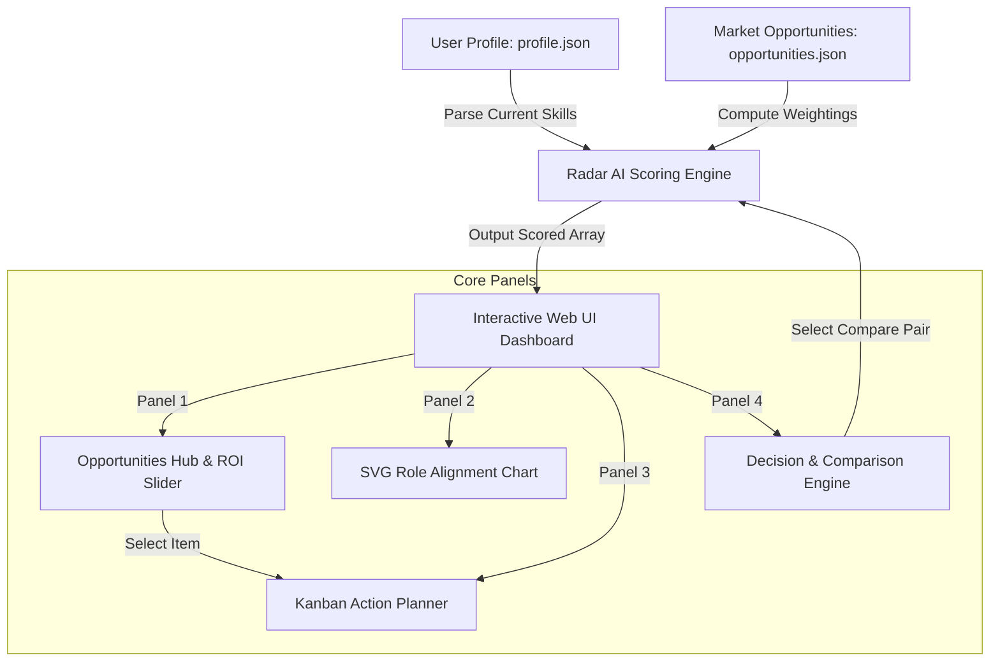

# Project Specification: Opportunity Radar AI 🚀

An autonomous, intelligence-driven career growth agent and strategist dashboard designed to maximize a developer's long-term career growth, skill acquisition, financial return, and industry visibility.

---

## 📋 System Architecture & Workflow

The core architecture follows a unidirectional data flow where user assets and external market opportunities are processed by the **Radar AI Scoring Engine**, visually mapped in a **Skill Alignment Matrix**, and scheduled inside a **Sprinting Kanban Board**.



---

## 🛠️ Deep Dive: The 8 Core Responsibilities

### 1. Profile Analysis
- Parses `profile.json` containing `user_name`, `skills` array, and past `projects`.
- Dynamically displays active skills and updates profiles directly in-app to dynamically sync with internal state.

### 2. Opportunity Discovery
- Filters available roles, certifications, projects, and hackathons in the main table.
- Dynamically segments by tags: `All`, `Projects`, `Certifications`, and `Hackathons`.

### 3. ROI Scoring Engine
Scores and ranks opportunities based on a balanced cost-benefit model. The ROI score is calculated using the following formula:

$$\text{ROI Score} = \frac{\text{Skill Dev} \times 0.25 + \text{Career Impact} \times 0.25 + \text{Networking} \times 0.15 + \text{Financial Benefit} \times 0.15}{1 + (\text{Difficulty} \times 0.04 + \frac{\text{Time Commitment (Hours)}}{100} \times 0.04)}$$

### 4. Action Planner
- Implements a 3-column weekly Kanban sprinting board (`To Do`, `In Progress`, `Completed`).
- Automatically updates progress statistics inside the dashboard summary card when items are checked off or moved.

### 5. Skill Gap Analyzer
- Visualizes gap metrics using an interactive multi-axis **SVG Radar Chart**.
- Maps your current profile shape directly against a predefined industry standard target profile (e.g. Full-Stack AI Engineer vs. MLOps Specialist).

### 6. Deadline Guardian
- Pulls target deadlines from `tasks` configurations.
- Calculates exact days remaining and renders high-priority warning cards inside the dashboard view.

### 7. Portfolio Builder
- Recommends actionable, end-to-end integration tasks (e.g., exposing model `.pkl` files through an API).
- Hosts templates and project parameters inside the developer's registry database.

### 8. Decision Assistant
- An interactive comparison engine. Select any two opportunities to output a strategic tradeoff analysis, showing Value/Hour index and a final recommended choice.

---

## 📊 Data Schema Definitions

### Profile Registry (`profile.json`)
```json
{
  "user_name": "Developer Name",
  "current_role": "Active Job Title / Status",
  "skills": ["Array", "Of", "Skills"],
  "projects": [
    {
      "name": "Project Title",
      "type": "Project Classification",
      "description": "Functional description of the application",
      "technologies": "Stack, libraries used"
    }
  ]
}
```

### Opportunities Registry (`opportunities.json`)
```json
{
  "id": "OPP-ID",
  "title": "Opportunity Title Name",
  "type": "Classification Category",
  "description": "Project or exam summary description",
  "skill_development": 8.5,
  "career_impact": 9.0,
  "networking_value": 7.0,
  "financial_benefit": 8.0,
  "difficulty": 6.5,
  "time_required_hours": 40,
  "score": 8.2,
  "status": "Recommendation Tag"
}
```
